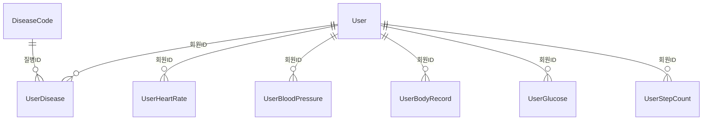

# 데이터 모델 (DATA MODEL)

Healthcare 프로젝트의 데이터 계약 문서. `health-backend`가 저장하는 **내부 DB 스키마**(1장)와, 외부 시뮬레이터가 전송하는 **WebSocket 이벤트 구조**(2장)를 다룬다. 모든 프로젝트(backend·web·mobile·ai)가 공통으로 참조한다.

## 목차
- 1. DB 스키마 (내부 저장 - ERD)
  - 1.1 회원관리테이블 (User)
  - 1.2 질병코드테이블 (DiseaseCode)
  - 1.3 회원-질병관리테이블 (UserDisease)
  - 1.4 회원-심박정보테이블 (UserHeartRate)
  - 1.5 회원-혈압정보테이블 (UserBloodPressure)
  - 1.6 회원-체중관리테이블 (UserBodyRecord)
  - 1.7 회원-혈당정보테이블 (UserGlucose)
  - 1.8 회원-걸음수정보테이블 (UserStepCount)
  - 1.9 테이블 관계
- 2. 외부 연동 - 건강정보 시뮬레이터 서버
  - 2.1 userProfile ~ 2.9 pong

---

## 1. DB 스키마 (내부 저장 - ERD)

> `health-backend`가 시뮬레이터로부터 수신한 데이터를 저장하는 내부 DB 테이블 구조다. 회원관리·질병코드 테이블은 사전 제공된 데이터를 따른다 (`docs/REQUIREMENTS.md` 1·3번 참고). 나머지 5개 테이블은 2장의 시뮬레이터 이벤트를 저장하기 위한 테이블이다.

### 1.1 회원관리테이블 (User)
로그인 인증 및 회원 기본정보. 환자·의사 계정을 모두 포함한다.

| 필드 | 타입 | 설명 |
|---|---|---|
| 회원ID | 문자열(20) | PK |
| 암호 | 문자열(200) | 로그인 비밀번호(해시 저장) |
| 회원명 | 문자열(50) | 이름 |
| 성별 | 문자열(1) | 성별 |
| 생년월일 | 문자열(8) | YYYYMMDD |
| 회원유형 | 문자열(4) | 환자/의사 구분 코드 |
| APIKey | 문자열(50) | 시뮬레이터 인증용 API Key ([SIMULATOR_API_SPEC.md](../health-backend/docs/SIMULATOR_API_SPEC.md) 1.1 접속 인증에서 사용) |
| 등록일 | 날짜시간 | 가입일시 |
| 수정일 | 날짜시간 | 정보 수정일시 |

### 1.2 질병코드테이블 (DiseaseCode)
질병 마스터 코드. 사전 제공된 데이터를 따른다.

| 필드 | 타입 | 설명 |
|---|---|---|
| 질병ID | 문자열(20) | PK |
| 질병명(영어) | 문자열(100) | 영문 질병명 |
| 질병명(한글) | 문자열(100) | 국문 질병명 |
| 질병카테고리 | 문자열(50) | 질병 분류 |
| 중증도 | 문자열(20) | 중증도 구분 |
| 질병설명 | 문자열(512) | 설명 |
| 등록일 | 날짜시간 | 등록일시 |
| 수정일 | 날짜시간 | 수정일시 |

### 1.3 회원-질병관리테이블 (UserDisease)
회원별 진단 이력. 회원(1) : 질병(N)을 중개하는 연결 테이블이다.

| 필드 | 타입 | 설명 |
|---|---|---|
| 진단시퀀스번호 | 숫자 | PK |
| 회원ID | 문자열(20) | FK → 회원관리테이블.회원ID |
| 질병ID | 문자열(20) | FK → 질병코드테이블.질병ID |
| 진단내용 | 문자열(512) | 진단 상세 |
| 진단일 | 날짜시간 | 진단일시 |
| 수정일 | 날짜시간 | 수정일시 |

### 1.4 회원-심박정보테이블 (UserHeartRate)
2.2 `heartRate` 이벤트의 저장 테이블.

| 필드 | 타입 | 설명 |
|---|---|---|
| 시퀀스번호 | 숫자 | PK |
| 회원ID | 문자열(20) | FK → 회원관리테이블.회원ID |
| 심박수 | 숫자 | 심박수(bpm) |
| 상태 | 문자열(200) | 측정 상태 |
| 비고 | 문자열(200) | 비고 |
| 측정일시 | 날짜시간 | 측정 시각 |
| 생성일시 | 날짜시간 | 저장(insert) 시각 |

### 1.5 회원-혈압정보테이블 (UserBloodPressure)
2.4 `bloodPressure` 이벤트의 저장 테이블.

| 필드 | 타입 | 설명 |
|---|---|---|
| 시퀀스번호 | 숫자 | PK |
| 회원ID | 문자열(20) | FK → 회원관리테이블.회원ID |
| 수축기 | 숫자 | 수축기 혈압(mmHg) |
| 이완기 | 숫자 | 이완기 혈압(mmHg) |
| 상태 | 문자열(200) | 혈압 상태 |
| 비고 | 문자열(200) | 비고 |
| 측정일시 | 날짜시간 | 측정 시각 |
| 생성일시 | 날짜시간 | 저장(insert) 시각 |

### 1.6 회원-체중관리테이블 (UserBodyRecord)
2.5 `weight` 이벤트의 저장 테이블. 2.1 `userProfile`의 `weightKg`/`bmi`가 참조하는 "최신 체중 기록"이 이 테이블이다.

| 필드 | 타입 | 설명 |
|---|---|---|
| 시퀀스번호 | 숫자 | PK |
| 회원ID | 문자열(20) | FK → 회원관리테이블.회원ID |
| 체중(kg) | 숫자 | 체중 |
| BMI | 숫자 | BMI |
| 골격근량 | 숫자 | 골격근량(kg) |
| 체지방률 | 숫자 | 체지방률(%) |
| 상태 | 문자열(100) | 상태 |
| 비고 | 문자열(200) | 비고 |
| 측정일시 | 날짜시간 | 측정 시각 |
| 생성일시 | 날짜시간 | 저장(insert) 시각 |

### 1.7 회원-혈당정보테이블 (UserGlucose)
2.6 `glucose` 이벤트의 저장 테이블.

| 필드 | 타입 | 설명 |
|---|---|---|
| 시퀀스번호 | 숫자 | PK |
| 회원ID | 문자열(20) | FK → 회원관리테이블.회원ID |
| 혈당값 | 숫자 | 혈당(mg/dL) |
| 상태 | 문자열(100) | 혈당 상태(2.6 `status`: normal/elevated/high) |
| 비고 | 문자열(200) | 비고 |
| 측정일시 | 날짜시간 | 측정 시각 |
| 생성일시 | 날짜시간 | 저장(insert) 시각 |

### 1.8 회원-걸음수정보테이블 (UserStepCount)
2.3 `stepCount` 이벤트의 저장 테이블.

| 필드 | 타입 | 설명 |
|---|---|---|
| 시퀀스번호 | 숫자 | PK |
| 회원ID | 문자열(20) | FK → 회원관리테이블.회원ID |
| 누적걸음수 | 숫자 | 당일 누적 걸음 수 |
| 측정일시 | 날짜시간 | 측정 시각 |
| 생성일시 | 날짜시간 | 저장(insert) 시각 |

### 1.9 테이블 관계



- 회원(1) : 질병진단(N) — 회원 1명은 진단 이력을 0건 이상 가질 수 있다.
- 질병코드(1) : 질병진단(N) — 질병코드 1건은 0명 이상의 회원에게 진단될 수 있다(회원-질병관리테이블이 다대다를 중개).
- 회원(1) : 심박/혈압/체중/혈당/걸음수 기록(N) — 각 측정 테이블은 회원ID로 회원관리테이블을 참조하는 1:N 관계다. (ERD상 관계선은 생략되어 있으나 회원ID 컬럼을 FK로 취급)

---

## 2. 외부 연동 - 건강정보 시뮬레이터 서버

> **⚠️ 외부 데이터 명세**
> 본 절은 우리 시스템이 자체 설계한 데이터 모델이 아니라, **외부 건강정보 시뮬레이터 서버**가 WebSocket으로
> 전송하는 이벤트별 데이터 구조와 값 생성 규칙을 정리한 문서입니다.
> 원본 출처: [`health-backend/docs/Health_interface.pdf`](../health-backend/docs/Health_interface.pdf) (Interface Specification - 응답 프로토콜 상세)
> 접속/인증 등 프로토콜 전반은 [SIMULATOR_API_SPEC.md](../health-backend/docs/SIMULATOR_API_SPEC.md) 를 참고하세요.

### 2.1 userProfile
- 발생 시점: 연결(`handleConnection`) 인증 성공 직후, 최초 1회
- 소스: `simulator.gateway.ts` → `SimulatorService.buildProfile()` → `UserService.buildUserProfile()`

| 필드 | 타입 | 설명 |
|---|---|---|
| userId | string | 사용자 ID |
| name | string | 이름 |
| age | number | 나이 |
| gender | "M" \| "F" | 성별 |
| heightCm | number | 키(cm) |
| weightKg | number | 최신 체중 기록(`UserBodyRecord`) 또는 `User.weightKg`, 없으면 0 |
| bmi | number | 최신 BMI 기록 또는 `User.bmi`, 없으면 0 |
| hypertension | boolean | `UserDisease`에 `HYP` 매핑 존재 여부 |
| diabetes | boolean | `UserDisease`에 `DIA` 매핑 존재 여부 |
| heartDisease | "myocardial_infarction" \| "arrhythmia" \| null | MI > ARR 우선순위로 판정, 둘 다 없으면 null |
| diseases | Array<{diseaseCode, name, nameKr}> | 보유한 모든 질환 매핑 |
| otherConditions | string[] | HYP / DIA / MI / ARR / none을 제외한 질환 코드 목록 (예: AST, SLP, CHO, ATH, THY) |

```json
{
  "event": "userProfile",
  "data": {
    "userId": "user_003",
    "name": "박지훈",
    "age": 45,
    "gender": "M",
    "heightCm": 172,
    "weightKg": 88,
    "bmi": 29.8,
    "hypertension": true,
    "diabetes": true,
    "heartDisease": null,
    "diseases": [
      { "diseaseCode": "HYP", "name": "Hypertension", "nameKr": "고혈압" },
      { "diseaseCode": "DIA", "name": "Diabetes", "nameKr": "당뇨병" }
    ],
    "otherConditions": []
  }
}
```

### 2.2 heartRate
- 발생 시점: 4초 주기(정상), 그리고 심장질환(MI) 또는 고혈압(HYP) 보유자는 10분 주기로 이상 수치가 동일한 이벤트로 추가 전송됨 (별도 이벤트명 없음)
- 소스: `simulator.service.ts` `sendHeartRate()` / `sendAbnormalEvent()`

| 필드 | 타입 | 설명 |
|---|---|---|
| timestamp | string | KST ISO 8601 |
| userId | string | 사용자 ID |
| heartRate | number | 심박수 (bpm) |
| source | "simulation" \| "abnormal_event" | 일반 생성값인지 이상 이벤트인지 구분 |
| note | string? | source가 abnormal_event일 때만 존재, 현재 고정값 "Possible tachycardia detected." |

**값 생성 로직**
- 기준: `baselineHeartRate` (회원별 고유값)
- 변동폭: 평상시 ±5bpm, 수면 중 ±2.5bpm, 부정맥(ARR) 보유 시 변동폭 추가(평상시 ±4bpm, 수면 중 ±2bpm)
- 고혈압/당뇨 보유 시 +2bpm 가산
- 수면 중: 기준치의 약 82%로 낮춤, 하한 42bpm (평상시 하한 50bpm)
- 이상 이벤트(10분 주기, MI/HYP 보유자만): 기준치(수면 중이면 82% 적용) + 20bpm + (MI 보유 시 +10bpm 추가) + 0~10 난수, 하한 100bpm

```json
{ "event": "heartRate", "data": { "timestamp": "2026-07-03T22:07:15.541+09:00", "userId": "user_003", "heartRate": 78, "source": "simulation" } }
```
```json
{ "event": "heartRate", "data": { "timestamp": "2026-07-03T22:10:00.000+09:00", "userId": "user_009", "heartRate": 132, "source": "abnormal_event", "note": "Possible tachycardia detected." } }
```

### 2.3 stepCount
- 발생 시점: 4.5초 주기
- 소스: `simulator.service.ts` `sendStepCount()`

| 필드 | 타입 | 설명 |
|---|---|---|
| timestamp | string | KST ISO 8601 |
| userId | string | 사용자 ID |
| stepCount | number | 해당 일자 누적 걸음 수 |
| dailyReset | boolean | 이번 틱에서 날짜가 바뀌어 0으로 초기화되었는지 여부 |

**값 생성 로직**
- 평상시: `max(10, baselineStepRate * 20 + 0~20 난수)` 만큼 매 틱 누적
- 수면 중: 90% 확률로 증가 0, 10% 확률로 1~5보만 증가 (화장실 이동 등 모사)
- 날짜 변경 판정은 KST(UTC+9) 기준으로 이루어짐 — 자정(KST 00:00)에 stepCount가 0으로 초기화되고 그 틱에서 `dailyReset: true`가 1회 표시됨

```json
{ "event": "stepCount", "data": { "timestamp": "2026-07-03T22:07:15.541+09:00", "userId": "user_003", "stepCount": 4213, "dailyReset": false } }
```

### 2.4 bloodPressure
- 발생 시점: 접속 즉시 1회, 이후 2시간 주기
- 소스: `simulator.service.ts` `sendBloodPressure()`

| 필드 | 타입 | 설명 |
|---|---|---|
| timestamp | string | KST ISO 8601 |
| userId | string | 사용자 ID |
| systolic | number | 수축기 혈압 (mmHg) |
| diastolic | number | 이완기 혈압 (mmHg) |
| source | string | 항상 "simulation" |

**값 생성 로직**
- 기준: 고혈압(HYP) 보유 시 수축기 140 / 이완기 90, 미보유 시 120 / 80
- 수면 중: 야간 혈압 하강(nocturnal dipping) 반영 — 기준치에 0.88 곱함, 변동폭도 절반
- 변동폭: 평상시 수축기 ±6, 이완기 ±4 / 수면 중 수축기 ±3, 이완기 ±2
- 하한: 수축기 90, 이완기 55

```json
{ "event": "bloodPressure", "data": { "timestamp": "2026-07-03T22:07:15.541+09:00", "userId": "user_003", "systolic": 138, "diastolic": 88, "source": "simulation" } }
```

### 2.5 weight
- 발생 시점: 접속 즉시 1회, 이후 매일 아침/점심/저녁(KST 08/12/18시)에 각 1회
- 소스: `simulator.service.ts` `sendWeight()` / `checkWeightSchedule()`

| 필드 | 타입 | 설명 |
|---|---|---|
| timestamp | string | KST ISO 8601 |
| userId | string | 사용자 ID |
| weightKg | number | 체중(kg) — userProfile과 동일 값(세션 중 고정) |
| bmi | number | BMI — userProfile과 동일 값 |
| skeletalMuscleMassKg | number | 골격근량(kg), 매 전송 시점마다 재계산 |
| bodyFatPercentage | number | 체지방률(%), 매 전송 시점마다 재계산 |
| source | string | 항상 "simulation" |

**값 생성 로직**
- 체지방률: Deurenberg 공식 `1.2×BMI + 0.23×나이 − 10.8×성별계수(남 1/여 0) − 5.4` + ±1%p 무작위 변동, 5~50% 범위로 clamp
- 골격근량: 체중 × (1 − 체지방률/100) 으로 구한 제지방량의 42~46%
- 하루 중 최대 3회(08/12/18시)만 전송되므로 수면 시간대와는 겹치지 않아 별도 보정 없음

```json
{ "event": "weight", "data": { "timestamp": "2026-07-03T22:07:15.541+09:00", "userId": "user_003", "weightKg": 88, "bmi": 29.8, "skeletalMuscleMassKg": 27.1, "bodyFatPercentage": 26.4, "source": "simulation" } }
```

### 2.6 glucose
- 발생 시점: 접속 즉시 1회, 이후 1시간 주기
- 소스: `simulator.service.ts` `sendGlucose()`

| 필드 | 타입 | 설명 |
|---|---|---|
| timestamp | string | KST ISO 8601 |
| userId | string | 사용자 ID |
| glucoseMgDl | number | 혈당(mg/dL) |
| status | "normal" \| "elevated" \| "high" | 140 이상 high, 110~139 elevated, 그 미만 normal |
| source | string | 항상 "simulation" |

**값 생성 로직**
- 공복 기준치: 당뇨(DIA) 보유 시 130, 미보유 시 95
- 변동폭: 평상시 당뇨 ±10 / 비당뇨 ±5, 수면 중에는 각각 ±5 / ±3으로 축소(식사가 없어 안정적)
- 식후 스파이크: 수면 중이 아니고 KST 08/12/18시 이후 2시간 이내일 때만 적용 — 비당뇨 +15~30, 당뇨 +40~70
- 새벽 현상(dawn phenomenon): 수면 중이며 당뇨 보유자이고 기상 1.5시간 이내로 남았을 때 +10~25 추가 상승
- 하한: 70

```json
{ "event": "glucose", "data": { "timestamp": "2026-07-03T22:07:15.541+09:00", "userId": "user_003", "glucoseMgDl": 145, "status": "high", "source": "simulation" } }
```

### 2.7 sleep
- 발생 시점: 접속 즉시 1회(직전 수면 기록), 이후 매일 기상 시각(KST 07시)에 1회
- 소스: `simulator.service.ts` `sendSleep()` / `checkSleepSchedule()`

| 필드 | 타입 | 설명 |
|---|---|---|
| timestamp | string | KST ISO 8601 |
| userId | string | 사용자 ID |
| sleepHours | number | 수면 시간(시간 단위, 소수 첫째 자리) |
| quality | "good" \| "fair" \| "poor" | 수면 품질 |
| bedTime | string | 취침 시각(KST) |
| wakeTime | string | 기상 시각(KST), 매일 07:00 고정 |
| source | string | 항상 "simulation" |

**값 생성 로직**
- 기준 수면시간: `userId`를 MD5 해시해 6.0~9.0시간 사이 값 고정 부여 (회원마다 다름, DB 스키마 변경 없이 계산)
- 나이 보정: 40세 이상 −0.3시간, 60세 이상 −0.6시간
- 매 전송 시 기준치에 ±0.6시간 무작위 변동
- 수면무호흡(SLP) 보유 시 0.8~1.8시간 추가 차감, 60% 확률로 품질을 무조건 poor로 강제
- 품질 분류(수면무호흡 강제 케이스 제외): 7.5시간↑ good, 6~7.5시간 fair, 6시간↓ poor
- bedTime은 wakeTime(당일 07:00 KST)에서 sleepHours만큼 역산

```json
{ "event": "sleep", "data": { "timestamp": "2026-07-03T07:00:00.000+09:00", "userId": "user_003", "sleepHours": 6.8, "quality": "fair", "bedTime": "2026-07-03T00:12:00.000+09:00", "wakeTime": "2026-07-03T07:00:00.000+09:00", "source": "simulation" } }
```

### 2.8 error
- 발생 시점: 연결 시 userId/apiKey 인증 실패
- 소스: `simulator.gateway.ts` `handleConnection()`

| 필드 | 타입 | 설명 |
|---|---|---|
| code | string | 고정값 "AUTH_FAILED" |
| message | string | 고정 문구 "Invalid userId or apiKey." |

```json
{ "event": "error", "data": { "code": "AUTH_FAILED", "message": "Invalid userId or apiKey." } }
```
> 인증 실패 시 이 이벤트 전송 직후 서버가 소켓 연결을 강제 종료한다.

### 2.9 pong
- 발생 시점: 클라이언트가 `ping` 이벤트를 보낼 때 그대로 echo
- 페이로드: 클라이언트가 보낸 `data`를 그대로 반환 (`{ event: 'pong', data }`)
